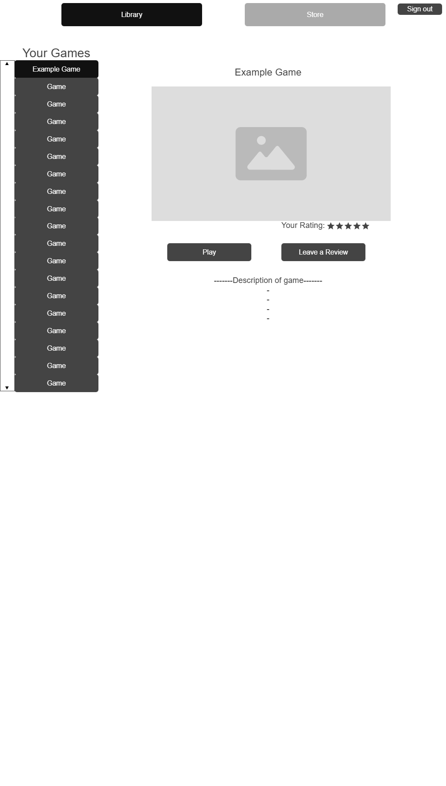
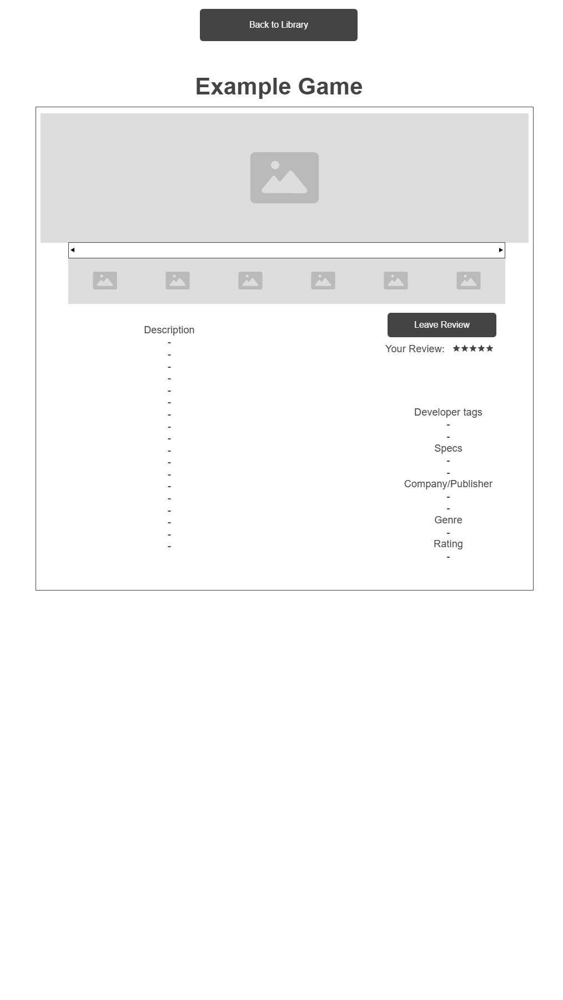
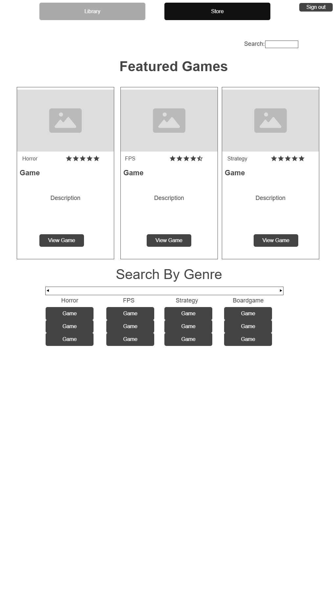
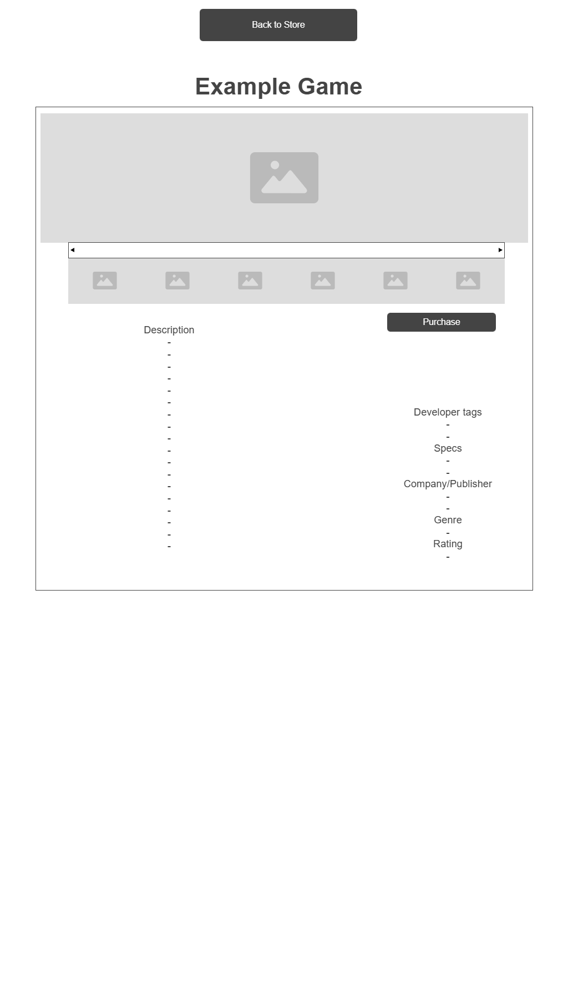

Game Library and Review Platform - CP476 Group 23 Project

The purpose of this website is to interact with a game store where you can purchase, review, and access games in a library based on your personal account.

Group Members

1. Jackson Blellock 169027803
2. Muhammad Imran 210725970
3. Kayleigh Zelichowski 169034544

This project is being designed to create a space where users can access games all from a single area. They must first log in and then once there they have access to two main pages

1. The first page being the library page. This is where users can interact with the games they have purchased in an organized list. They can click on their games to open a page fully tailored to that specific game. From this page they are able to review the game based on their expeirence and publish the review.

2. The second page being the store page. Users can access the store to browse and search for games. They will be able to add games to their library. Games will be displayed throughout this page and the user is able to pick and choose which game they might look at and potentially purchase. Just like the Library section, users can click on a game and a tailored tab will pop up for the game where they can look at the details as they could in the library, the just wont be able to leave a review.

\*Diagram/Video of this website to be inserted upon completion. Wireframe to be implemented in place for the time being

## Wireframes (Milestone 01)

Wireframes are provided to illustrate the primary user workflow. These will be
replaced with a recorded demo video upon project completion.

### Sign In Page

This screen allows users to sign in and access their personal game library.


### Library Page

Displays all games owned by the user with navigation to the store and sign-out.



### Library Game Page

Allows users to view game details and submit a review.



### Store Page

Displays all available games that can be purchased using earned tokens.



### Store Game Page

Displays game details and allows users to purchase the game.



User instructions

## How to Run Front end Locally

### Requirments:

- Browser of choice
- Git installed on your device

### Steps

1. Clone the repository

- Use the following link to be able to clone the repo: https://github.com/ItzJagger/cp476-group23-project.git

2. Navigate to the Front end Folder of the Repo

- Folder name: frontend

3. Open the Sign in Page

- Open the 'signin.html' file in your web browser
  - Either Double click the file in your file explorer
  - Right click the file, Go to open with and select your browser

4. NAvigate the Web page

- At the sign in page, just click sign in as it will take you to the next page regardless of what is in the two boxes
- View the store and Library as freely as you want but reminder these are very early stages and many of these features are only there for visual purposes.

Known Issues - To be filled out upon development
Frontend

- Sign in feature is not tied into the application yet, No user or password is needed, sign is allowed without either for the time being
- Buttons such as the searc, purchase, genre, leave a review all have no functional purpose, they are just there to show where they will be in the final site

# Game Library API - Backend

Backend server for the CP476 Group 23 Game Library and Review Platform.

## Getting Started

### Prerequisites

- Node.js (v14 or higher)

### Installation

```bash
cd backend
npm install
```

### Running the Server

```bash
node server.js
```

Server runs at **http://localhost:3000**

---

## API Endpoints

### Authentication (`/api/auth`)

| Method | Endpoint             | Description                |
| ------ | -------------------- | -------------------------- |
| POST   | `/api/auth/register` | Register a new user        |
| POST   | `/api/auth/login`    | Login user                 |
| POST   | `/api/auth/logout`   | Logout user                |
| GET    | `/api/auth/me`       | Get current logged in user |

**Register/Login body:**

```json
{
  "email": "user@example.com",
  "password": "password123",
  "username": "player1"
}
```

---

### Games (`/api/games`)

| Method | Endpoint                      | Description             |
| ------ | ----------------------------- | ----------------------- |
| GET    | `/api/games`                  | Get all games           |
| GET    | `/api/games/search?query=xxx` | Search games            |
| GET    | `/api/games/:id`              | Get single game by ID   |
| POST   | `/api/games`                  | Create new game (admin) |
| PUT    | `/api/games/:id`              | Update game (admin)     |
| DELETE | `/api/games/:id`              | Delete game (admin)     |

---

### User Library (`/api/library`)

| Method | Endpoint                     | Description                     |
| ------ | ---------------------------- | ------------------------------- |
| GET    | `/api/library`               | Get current user's game library |
| GET    | `/api/library/:gameId`       | Get specific game from library  |
| GET    | `/api/library/check/:gameId` | Check if user owns a game       |
| POST   | `/api/library/:gameId`       | Add game to library (purchase)  |
| DELETE | `/api/library/:gameId`       | Remove game from library        |

---

### Reviews (`/api/reviews`)

| Method | Endpoint                    | Description                |
| ------ | --------------------------- | -------------------------- |
| GET    | `/api/reviews/game/:gameId` | Get all reviews for a game |
| GET    | `/api/reviews/user/:userId` | Get all reviews by a user  |
| GET    | `/api/reviews/:id`          | Get single review          |
| POST   | `/api/reviews/game/:gameId` | Create review for a game   |
| PUT    | `/api/reviews/:id`          | Update a review            |
| DELETE | `/api/reviews/:id`          | Delete a review            |

**Create/Update review body:**

```json
{
  "rating": 5,
  "comment": "Great game!"
}
```

---

## Project Structure

```
backend/
├── server.js              # Main entry point
├── package.json           # Dependencies
├── routes/
│   ├── auth.js            # Auth route definitions
│   ├── games.js           # Games route definitions
│   ├── library.js         # Library route definitions
│   └── reviews.js         # Reviews route definitions
└── controllers/
    ├── authController.js      # Auth logic
    ├── gamesController.js     # Games logic
    ├── libraryController.js   # Library logic
    └── reviewsController.js   # Reviews logic
```

---

## Current Status

All endpoints return **stub/dummy data**.

### TODO

- [ ] Add database (MySQL/MongoDB)
- [ ] Implement JWT authentication
- [ ] Connect controllers to database
- [ ] Add input validation
- [ ] Add error handling middleware

---

Summary of Team Member Contributions

1. Jackson Blellock:
   - Implemented core screens that match the wireframes of Milestone 1
   - Developed primary workflow functional in the UI
   - Updated the Blog/Wiki
2. Muhammad Imran:
   - Initialized the backend with npm init and installed Express + CORS
   - Created server.js as the main entry point (runs on port 3000)
   - Created routes/folder with route files for auth, games, library, and reviews
   - Created controllers/ folder with controller files containing stub logic for each route
   - Tested the server locally at http://localhost:3000/
   - Created a README.md documenting all API endpoints and project structure
3. Kayleigh Zelichowski:
   - Created relational database diagram with primary, foreign, and other important keys, and specific datatypes for attributes
   - Edited/added tables in diagram to avoid obvious redundancies and anomalies
   - Documented constraints where necessary
   - Wrote valid SQL CREATE TABLE statements, tested via Programiz online SQL editor
   - Added the team plan to this readme

Each team member is responsible for pushing/committing their own progress to the GitHub page.
